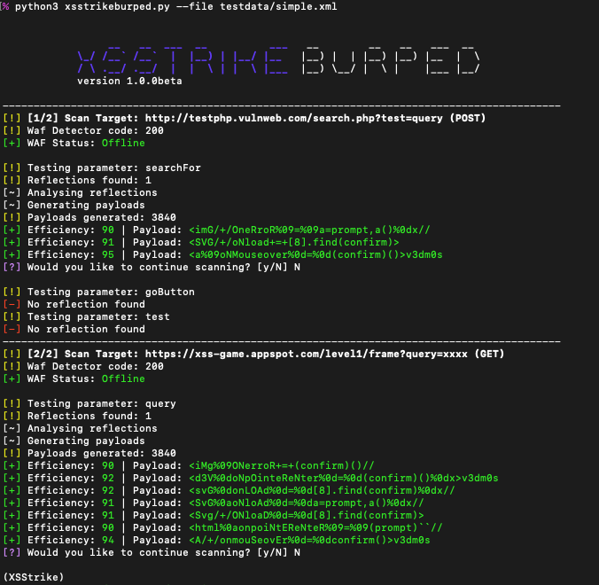
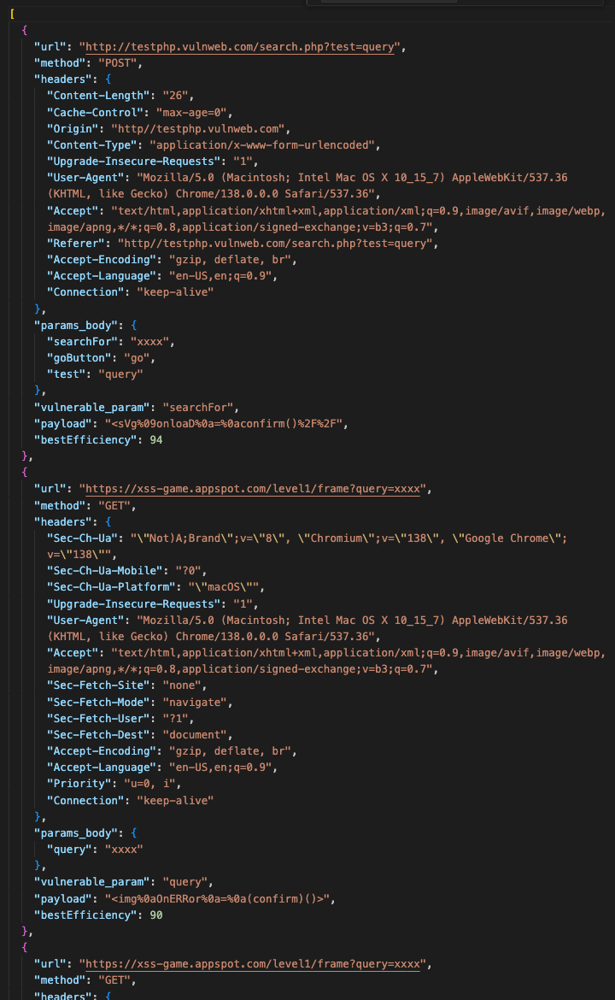

<h1 align="center">
  <br>
  XSStrikeBurped 
  <br>
</h1>

<h4 align="center">XSS Detection For Burp Exports</h4>

Burp Suite has a good cross-site scripting reflection and detection integration. However, it lacks strong options for exploiting, so researchers often rely on external tools. Burp requests then have to be rebuilt laboriously for those tools.

This forked, significantly modified and simplified version of [XSStrike](https://github.com/s0md3v/XSStrike) (based on v3.1.6) is a way to close that gap and to easily test exported Burp requests for XSS vulnerabilities. 

The tool takes each exported request and reconstructs it, not only recognizing the method (GET and POST; all others are skipped) but also preserving all headers, including any session information. It tests both URL-based and body-based parameters. If sessions have expired, they can be overridden by setting the `--header` argument manually.

It also fixes a bug ([#432](https://github.com/s0md3v/XSStrike/issues/432)) and some minor issues discovered in the original tool.

### Install
```
git clone https://github.com/s0md3v/XSStrike
python -m venv XSStrikeBurped
cd XSStrikeBurped
source bin/activate
pip install -r requirements.txt
```

### Usage

```
python xsstrikeburped.py -h

  -h, --help         show this help message and exit
  --file BURP_FILE   burp export file
  --header HEADER    provide an additional header or replace an existing one
  --delay DELAY      delay between requests
  --timeout TIMEOUT  timeout
  --skip             don't ask to continue
  --blind BLIND_XSS  inject blind XSS payload
  --path             inject payloads in the path
  --proxy            use prox(y|ies)
```
```
python xsstrikeburped.py --file burp_export.xml
```



Findings are output in file `findings-<TIMESTAMP>.json`, including all request information as well as the vulnerable parameter, efficiency and the discovered payload.



## License
Licensed under GNU GPLv3, following the XSStrike license.